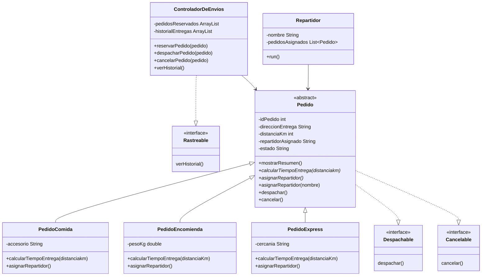

# SpeedFast

Sistema de gestión de pedidos y despacho para **SpeedFast**, una empresa de reparto a domicilio que ofrece tres tipos de servicio: comida, encomiendas y compras express.

Proyecto desarrollado como actividad formativa de la asignatura **Desarrollo Orientado a Objetos II** (Semana 3 — Clases abstractas, polimorfismo e interfaces — y Semana 4 — Programación concurrente con hilos).

## Descripción

Sobre la base construida en la semana 2 (clase abstracta `Pedido` y sus subclases), esta entrega agrega:

- Asignación de repartidores, automática (según el tipo de pedido) y manual.
- Interfaces `Despachable`, `Cancelable` y `Rastreable` para desacoplar responsabilidades.
- La clase `ControladorDeEnvios`, que coordina la reserva, el despacho, la cancelación y el historial de entregas.

## Estructura del proyecto

- `src/main/java/Main.java` — Punto de entrada: simula reserva, asignación de repartidores, despacho, cancelación e historial.
- `src/main/java/com/puertogames/servicio/Pedido.java` — Clase base abstracta. Implementa `Despachable` y `Cancelable`.
- `src/main/java/com/puertogames/servicio/PedidoComida.java` — Asigna repartidor según la distancia (bicicleta o moto).
- `src/main/java/com/puertogames/servicio/PedidoEncomienda.java` — Asigna repartidor según el peso del paquete.
- `src/main/java/com/puertogames/servicio/PedidoExpress.java` — Asigna repartidor según la zona de cercanía.
- `src/main/java/com/puertogames/interfaces/Despachable.java` — Declara `despachar()`.
- `src/main/java/com/puertogames/interfaces/Cancelable.java` — Declara `cancelar()`.
- `src/main/java/com/puertogames/interfaces/Rastreable.java` — Declara `verHistorial()`.
- `src/main/java/com/puertogames/controlador/ControladorDeEnvios.java` — Reserva pedidos, delega el despacho y la cancelación en cada `Pedido` e implementa `Rastreable` para el historial de entregas.
- `src/main/java/com/puertogames/servicio/Repartidor.java` — Hilo (`Runnable`) que entrega, en orden, los pedidos que se le asignaron a un repartidor (Semana 4).

## Conceptos aplicados

- Clase abstracta: `Pedido` define los atributos comunes (`idPedido`, `direccionEntrega`, `distanciaKm`, `repartidorAsignado`, `estado`) y el comportamiento reutilizable `mostrarResumen()`.
- Métodos abstractos: `calcularTiempoEntrega()` y `asignarRepartidor()` se declaran en `Pedido` sin implementación y cada subclase los completa con su propia lógica.
- Sobrescritura (override): `PedidoComida`, `PedidoEncomienda` y `PedidoExpress` redefinen `calcularTiempoEntrega()` y `asignarRepartidor()`, cada una con su propia regla de negocio.
- Sobrecarga (overload): `asignarRepartidor()` automática convive con `asignarRepartidor(String nombre)` para asignación manual, implementada una sola vez en `Pedido` y reutilizada por las subclases.
- Interfaces: `Despachable` y `Cancelable` las implementa `Pedido` y las heredan las tres subclases. `Rastreable` la implementa `ControladorDeEnvios`, que centraliza la reserva y el historial de entregas.
- Herencia: las subclases reutilizan atributos, constructor, `mostrarResumen()`, `asignarRepartidor(String)`, `despachar()` y `cancelar()` de `Pedido`.

## Diagrama de clases



## Requisitos

- JDK 25 (o superior)
- Maven (opcional, para compilar con `pom.xml`)
- IntelliJ IDEA (entorno de desarrollo recomendado)

## Cómo ejecutar

Desde IntelliJ IDEA, abrir el proyecto y ejecutar la clase `Main`.

Desde línea de comandos:

```
javac -d out $(find src/main/java -name "*.java")
java -cp out Main
```

## Salida esperada (resumen)

El programa reserva un pedido de cada tipo (Comida, Encomienda, Express), asigna repartidor de forma automática a dos de ellos y de forma manual al tercero, muestra el resumen y el tiempo estimado de cada uno, despacha dos pedidos, cancela el pedido restante y finalmente imprime el historial de entregas realizadas.

## Semana 4 — Concurrencia con hilos

Sobre la base construida en la semana 3 (clase abstracta `Pedido`, sus subclases y las interfaces `Despachable`, `Cancelable` y `Rastreable`), esta entrega agrega programación concurrente para simular repartidores entregando pedidos al mismo tiempo:

- La clase `Repartidor`, que implementa `Runnable` y representa a un repartidor recorriendo su propia lista de pedidos de forma secuencial.
- Simulación del tiempo de viaje con `Thread.sleep()` usando una demora aleatoria por pedido.
- Ejecución de varios repartidores en paralelo mediante `ExecutorService`, cada uno corriendo como un hilo independiente.

### Estructura agregada

- `src/main/java/com/puertogames/servicio/Repartidor.java` — Hilo que entrega, en orden, los pedidos que se le asignaron.
- `src/main/java/Main.java` — Ahora crea tres repartidores con dos o más pedidos cada uno y los lanza en paralelo con un `ExecutorService`.

### Cómo se organizó la concurrencia

- Cada `Repartidor` recibe su propio nombre y su propia lista de `Pedido` en el constructor, por lo que no hay memoria compartida entre hilos: cada uno trabaja únicamente sobre sus propios objetos y no hace falta sincronizar nada.
- El método `run()` recorre la lista de pedidos y, por cada uno, asigna el repartidor (reutilizando `asignarRepartidor(String)` de la semana 3), imprime el mensaje de avance, simula el viaje con una pausa aleatoria de entre 1 y 3 segundos y llama a `despachar()` al terminar.
- En `Main`, se instancian tres repartidores (Camila, Luis y Fernanda) con dos pedidos cada uno y se ejecutan con `Executors.newFixedThreadPool(3)`. El programa espera con `executor.awaitTermination()` hasta que todos los repartidores terminen sus entregas antes de finalizar.
- Si un hilo es interrumpido mientras espera (`Thread.sleep`), se captura `InterruptedException`, se restaura el flag de interrupción con `Thread.currentThread().interrupt()` y se corta únicamente la entrega de ese repartidor, sin afectar a los demás hilos ni caer el programa.
- Se agregó además un `catch` genérico dentro del `run()` para que, si un pedido puntual falla por cualquier otro motivo, el repartidor continúe con el resto de sus pedidos en vez de terminar el hilo abruptamente.

### Ejemplo de salida por consola

Como los repartidores corren en paralelo, el orden exacto de las líneas cambia en cada ejecución (eso es justamente lo que se busca simular). Un fragmento típico se ve así:

```
================ INICIO DE ENTREGAS SIMULTANEAS ================

Repartidor asignado manualmente al pedido 101: Camila
[Repartidor: Camila] Entregando PedidoComida #101...
Repartidor asignado manualmente al pedido 102: Luis
[Repartidor: Luis] Entregando PedidoExpress #102...
Repartidor asignado manualmente al pedido 103: Fernanda
[Repartidor: Fernanda] Entregando PedidoEncomienda #103...
Pedido 103 despachado con Fernanda. Tiempo estimado: 43 min.
[Repartidor: Fernanda] Pedido #103 entregado.
...
[Repartidor: Camila] Termino todas sus entregas.
[Repartidor: Luis] Termino todas sus entregas.
[Repartidor: Fernanda] Termino todas sus entregas.

================ TODOS LOS REPARTIDORES TERMINARON SUS ENTREGAS ================
```

## Autor

Vicente Castro
