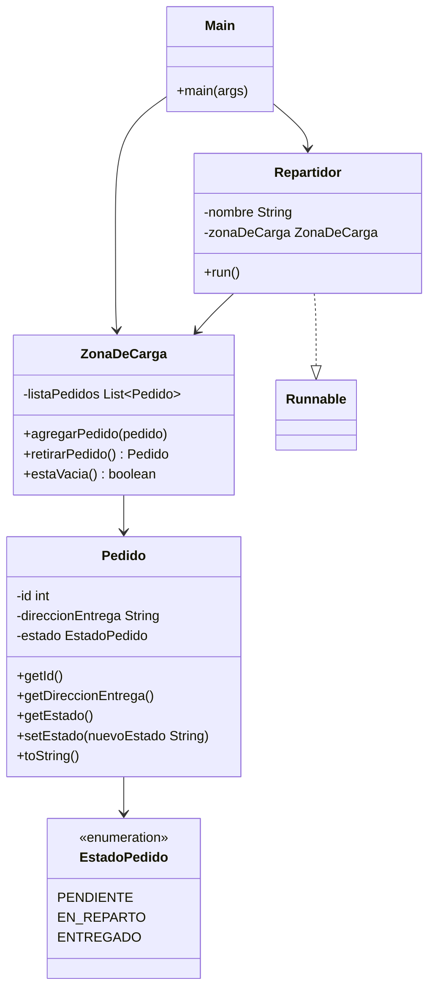

# SpeedFast — Semana 5: Sincronizando procesos en sistemas concurrentes

Actividad formativa individual de la asignatura **Desarrollo Orientado a Objetos II**, Semana 5.

## Caso: coordinación de entregas en SpeedFast

SpeedFast detectó que, durante el despacho, varios repartidores podían acceder al mismo tiempo a la zona de carga y retirar el mismo pedido, provocando errores y entregas duplicadas. Esta entrega implementa un sistema concurrente en Java que sincroniza el acceso a la zona de carga compartida, garantizando que cada pedido sea retirado y entregado por un único repartidor.

## Estructura del proyecto

- `src/main/java/com/puertogames/semana5/Pedido.java` — Representa un pedido: `id`, `direccionEntrega` y `estado` (`EstadoPedido`). Nace en estado `PENDIENTE`. Expone `setEstado(String nuevoEstado)`, que convierte el texto recibido a la constante del enum correspondiente.
- `src/main/java/com/puertogames/semana5/EstadoPedido.java` — Enum con los tres estados posibles de un pedido: `PENDIENTE`, `EN_REPARTO`, `ENTREGADO`.
- `src/main/java/com/puertogames/semana5/ZonaDeCarga.java` — Recurso compartido entre repartidores. Guarda los pedidos pendientes en una `List<Pedido>` (`LinkedList`) y expone `agregarPedido(Pedido)` y `retirarPedido()` como métodos `synchronized`, evitando que dos hilos retiren el mismo pedido al mismo tiempo.
- `src/main/java/com/puertogames/semana5/Repartidor.java` — Implementa `Runnable`. Cada repartidor retira pedidos de la `ZonaDeCarga` uno a la vez, los marca `EN_REPARTO`, simula el viaje con `Thread.sleep()` y los marca `ENTREGADO`, hasta que la zona de carga se queda sin pedidos.
- `src/main/java/com/puertogames/semana5/Main.java` — Punto de entrada: crea la `ZonaDeCarga`, agrega 5 pedidos, lanza 3 `Repartidor` (Juan, Camila, Pedro) sobre un `ExecutorService` y espera a que todos terminen antes de finalizar.

## Cómo se controla la concurrencia

- Los tres `Repartidor` reciben la **misma instancia** de `ZonaDeCarga`: es el recurso compartido donde puede producirse una condición de carrera.
- `agregarPedido`, `retirarPedido` y `estaVacia` son `synchronized`: solo un hilo a la vez puede ejecutar código sincronizado sobre esa instancia, así que "revisar si hay pedidos" y "sacar el pedido" ocurren como una operación indivisible, sin que otro repartidor pueda intercalarse y llevarse el mismo pedido.
- `retirarPedido()` devuelve `null` cuando ya no quedan pedidos; cada `Repartidor` usa eso para saber cuándo terminar su ciclo `while`.
- `Thread.sleep()` dentro de `run()` está protegido con `try/catch (InterruptedException e)`: si el hilo es interrumpido, se restaura el flag con `Thread.currentThread().interrupt()` y ese repartidor corta su ejecución sin afectar a los demás.
- `Main` usa `ExecutorService.awaitTermination()` para esperar a que los 3 repartidores terminen antes de imprimir el mensaje final, evitando reportar el cierre del sistema antes de tiempo.

## Diagrama de clases



## Requisitos

- JDK 25 (o superior)
- Maven (opcional, para compilar con `pom.xml`)
- IntelliJ IDEA (entorno de desarrollo recomendado)

## Cómo ejecutar

Desde IntelliJ IDEA: abrir el proyecto y ejecutar `com.puertogames.semana5.Main`.

Desde línea de comandos:

```
javac -d out $(find src/main/java -name "*.java")
java -cp out com.puertogames.semana5.Main
```

## Salida esperada (resumen)

El programa agrega 5 pedidos a la zona de carga y lanza 3 repartidores en paralelo. Cada repartidor retira pedidos uno a uno hasta que no quedan más, imprimiendo su avance por consola. Como los 3 hilos corren al mismo tiempo, el orden exacto de las líneas entre repartidores puede variar en cada ejecución — eso es justamente la concurrencia real funcionando. Un fragmento típico se ve así:

```
[Zona de carga inicializada]
Pedido: 1 agregado. | Destino: Santiago Centro
Pedido: 2 agregado. | Destino: Providencia
Pedido: 3 agregado. | Destino: Ñuñoa
Pedido: 4 agregado. | Destino: Clinica Davila, Recoleta
Pedido: 5 agregado. | Destino: Las Condes
[Repartidor - Juan] Retirando pedido #1...
[Repartidor - Juan] Estado: EN_REPARTO
[Repartidor - Juan] Entregando pedido #1...
[Repartidor - Camila] Retirando pedido #2...
[Repartidor - Camila] Estado: EN_REPARTO
[Repartidor - Camila] Entregando pedido #2...
[Repartidor - Pedro] Retirando pedido #3...
[Repartidor - Pedro] Estado: EN_REPARTO
[Repartidor - Pedro] Entregando pedido #3...
[Repartidor - Juan] Estado: ENTREGADO
[Repartidor - Juan] Retirando pedido #4...
...
[Repartidor - Pedro] No quedan más pedidos. Termina su turno.
[Zona de carga vacía]
Todos los pedidos han sido entregados correctamente.
```

## Autor

Vicente Castro
