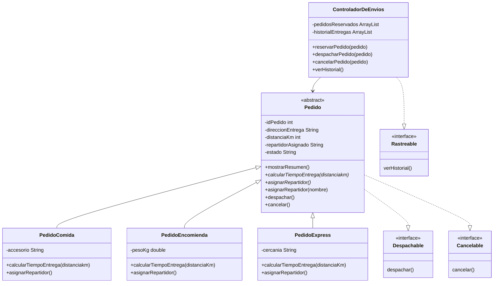

# SpeedFast

Sistema de gestión de pedidos y despacho para **SpeedFast**, una empresa de reparto a domicilio que ofrece tres tipos de servicio: comida, encomiendas y compras express.

Proyecto desarrollado como actividad formativa de la asignatura **Desarrollo Orientado a Objetos II** (Semana 3 — Clases abstractas, polimorfismo e interfaces).

## Descripción

Sobre la base construida en la semana 2 (clase abstracta `Pedido` y sus subclases), esta entrega agrega:

- Asignación de repartidores, automática (según el tipo de pedido) y manual.
- Interfaces `Despachable`, `Cancelable` y `Rastreable` para desacoplar responsabilidades.
- La clase `ControladorDeEnvios`, que coordina la reserva, el despacho, la cancelación y el historial de entregas.

## Estructura del proyecto

- `src/main/java/Main.java` — Punto de entrada: simula reserva, asignación de repartidores, despacho, cancelación e historial.
- `src/main/java/com/puertogames/servicio/Pedido.java` — Clase base abstracta. Implementa `Despachable` y `Cancelable`.
- `src/main/java/com/puertogames/servicio/PedidoComida.java` — Asigna repartidor según la distancia (bicicleta o moto).
- `src/main/java/com/puertogames/servicio/PedidoEncomienda.java` — Asigna repartidor según el peso del paquete.
- `src/main/java/com/puertogames/servicio/PedidoExpress.java` — Asigna repartidor según la zona de cercanía.
- `src/main/java/com/puertogames/interfaces/Despachable.java` — Declara `despachar()`.
- `src/main/java/com/puertogames/interfaces/Cancelable.java` — Declara `cancelar()`.
- `src/main/java/com/puertogames/interfaces/Rastreable.java` — Declara `verHistorial()`.
- `src/main/java/com/puertogames/controlador/ControladorDeEnvios.java` — Reserva pedidos, delega el despacho y la cancelación en cada `Pedido` e implementa `Rastreable` para el historial de entregas.

## Conceptos aplicados

- Clase abstracta: `Pedido` define los atributos comunes (`idPedido`, `direccionEntrega`, `distanciaKm`, `repartidorAsignado`, `estado`) y el comportamiento reutilizable `mostrarResumen()`.
- Métodos abstractos: `calcularTiempoEntrega()` y `asignarRepartidor()` se declaran en `Pedido` sin implementación y cada subclase los completa con su propia lógica.
- Sobrescritura (override): `PedidoComida`, `PedidoEncomienda` y `PedidoExpress` redefinen `calcularTiempoEntrega()` y `asignarRepartidor()`, cada una con su propia regla de negocio.
- Sobrecarga (overload): `asignarRepartidor()` automática convive con `asignarRepartidor(String nombre)` para asignación manual, implementada una sola vez en `Pedido` y reutilizada por las subclases.
- Interfaces: `Despachable` y `Cancelable` las implementa `Pedido` y las heredan las tres subclases. `Rastreable` la implementa `ControladorDeEnvios`, que centraliza la reserva y el historial de entregas.
- Herencia: las subclases reutilizan atributos, constructor, `mostrarResumen()`, `asignarRepartidor(String)`, `despachar()` y `cancelar()` de `Pedido`.

## Diagrama de clases



## Requisitos

- JDK 25 (o superior)
- Maven (opcional, para compilar con `pom.xml`)
- IntelliJ IDEA (entorno de desarrollo recomendado)

## Cómo ejecutar

Desde IntelliJ IDEA, abrir el proyecto y ejecutar la clase `Main`.

Desde línea de comandos:

```
javac -d out $(find src/main/java -name "*.java")
java -cp out Main
```

## Salida esperada (resumen)

El programa reserva un pedido de cada tipo (Comida, Encomienda, Express), asigna repartidor de forma automática a dos de ellos y de forma manual al tercero, muestra el resumen y el tiempo estimado de cada uno, despacha dos pedidos, cancela el pedido restante y finalmente imprime el historial de entregas realizadas.

## Autor

Vicente Castro
